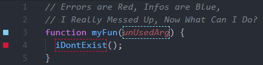
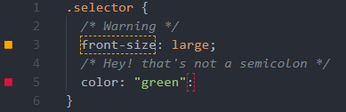

# NICER ERRORS 

Makes errors look a bit more like they do in Sublime Text.

## Features

It allows you to decorate (eg. border, highlight) errors and other diagnostics.  
It also shows gutter icons (left side of line numbers) on lines with problems.




It works with any language that provides diagnostics.  



## Requirements

You probably want to hide the native VSCode markings (squiggly lines) by customizing your theme:  
```json
"workbench.colorCustomizations": {
  "editorError.foreground":   "#0000",
  "editorWarning.foreground": "#0000",
  "editorInfo.foreground":    "#0000",
  "editorHint.foreground": "#0000",
}
```
Note: some other colors may be inheriting from these in your theme so you might have to change them too.

## Extension Settings

WIP!

## Known Issues

Too many... and don't get me started about the unknown issues!

Most notably:
- Styles clash and often look really ugly, especially on line boundaries (I have to work on that)
- Gutter icons render on top of breakpoint marks ([not my fault!](https://github.com/microsoft/vscode/issues/5923))

## Release Notes

### 0.0.0

Hardly working! :D
